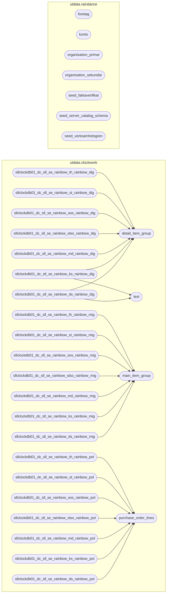

```mermaid
flowchart LR
    subgraph utdata.clockwork["utdata.clockwork"]
        direction LR
        detail_item_group(["detail_item_group"])
        main_item_group(["main_item_group"])
        purchase_order_lines(["purchase_order_lines"])
        sllclockdb01_dc_sll_se_rainbow_ds_rainbow_dig(["sllclockdb01_dc_sll_se_rainbow_ds_rainbow_dig"])
        sllclockdb01_dc_sll_se_rainbow_ds_rainbow_mig(["sllclockdb01_dc_sll_se_rainbow_ds_rainbow_mig"])
        sllclockdb01_dc_sll_se_rainbow_ds_rainbow_pol(["sllclockdb01_dc_sll_se_rainbow_ds_rainbow_pol"])
        sllclockdb01_dc_sll_se_rainbow_ks_rainbow_dig(["sllclockdb01_dc_sll_se_rainbow_ks_rainbow_dig"])
        sllclockdb01_dc_sll_se_rainbow_ks_rainbow_mig(["sllclockdb01_dc_sll_se_rainbow_ks_rainbow_mig"])
        sllclockdb01_dc_sll_se_rainbow_ks_rainbow_pol(["sllclockdb01_dc_sll_se_rainbow_ks_rainbow_pol"])
        sllclockdb01_dc_sll_se_rainbow_md_rainbow_dig(["sllclockdb01_dc_sll_se_rainbow_md_rainbow_dig"])
        sllclockdb01_dc_sll_se_rainbow_md_rainbow_mig(["sllclockdb01_dc_sll_se_rainbow_md_rainbow_mig"])
        sllclockdb01_dc_sll_se_rainbow_md_rainbow_pol(["sllclockdb01_dc_sll_se_rainbow_md_rainbow_pol"])
        sllclockdb01_dc_sll_se_rainbow_slso_rainbow_dig(["sllclockdb01_dc_sll_se_rainbow_slso_rainbow_dig"])
        sllclockdb01_dc_sll_se_rainbow_slso_rainbow_mig(["sllclockdb01_dc_sll_se_rainbow_slso_rainbow_mig"])
        sllclockdb01_dc_sll_se_rainbow_slso_rainbow_pol(["sllclockdb01_dc_sll_se_rainbow_slso_rainbow_pol"])
        sllclockdb01_dc_sll_se_rainbow_sos_rainbow_dig(["sllclockdb01_dc_sll_se_rainbow_sos_rainbow_dig"])
        sllclockdb01_dc_sll_se_rainbow_sos_rainbow_mig(["sllclockdb01_dc_sll_se_rainbow_sos_rainbow_mig"])
        sllclockdb01_dc_sll_se_rainbow_sos_rainbow_pol(["sllclockdb01_dc_sll_se_rainbow_sos_rainbow_pol"])
        sllclockdb01_dc_sll_se_rainbow_st_rainbow_dig(["sllclockdb01_dc_sll_se_rainbow_st_rainbow_dig"])
        sllclockdb01_dc_sll_se_rainbow_st_rainbow_mig(["sllclockdb01_dc_sll_se_rainbow_st_rainbow_mig"])
        sllclockdb01_dc_sll_se_rainbow_st_rainbow_pol(["sllclockdb01_dc_sll_se_rainbow_st_rainbow_pol"])
        sllclockdb01_dc_sll_se_rainbow_th_rainbow_dig(["sllclockdb01_dc_sll_se_rainbow_th_rainbow_dig"])
        sllclockdb01_dc_sll_se_rainbow_th_rainbow_mig(["sllclockdb01_dc_sll_se_rainbow_th_rainbow_mig"])
        sllclockdb01_dc_sll_se_rainbow_th_rainbow_pol(["sllclockdb01_dc_sll_se_rainbow_th_rainbow_pol"])
        test(["test"])
    end

    subgraph utdata.raindance["utdata.raindance"]
        direction LR
        foretag(["foretag"])
        konto(["konto"])
        organisation_primar(["organisation_primar"])
        organisation_sekundar(["organisation_sekundar"])
        seed_faktaverifikat(["seed_faktaverifikat"])
        seed_server_catalog_schema(["seed_server_catalog_schema"])
        seed_verksamhetsgren(["seed_verksamhetsgren"])
    end

    %% utdata.clockwork -> utdata.clockwork
    sllclockdb01_dc_sll_se_rainbow_ds_rainbow_dig --> detail_item_group
    sllclockdb01_dc_sll_se_rainbow_ds_rainbow_dig --> test
    sllclockdb01_dc_sll_se_rainbow_ds_rainbow_mig --> main_item_group
    sllclockdb01_dc_sll_se_rainbow_ds_rainbow_pol --> purchase_order_lines
    sllclockdb01_dc_sll_se_rainbow_ks_rainbow_dig --> detail_item_group
    sllclockdb01_dc_sll_se_rainbow_ks_rainbow_dig --> test
    sllclockdb01_dc_sll_se_rainbow_ks_rainbow_mig --> main_item_group
    sllclockdb01_dc_sll_se_rainbow_ks_rainbow_pol --> purchase_order_lines
    sllclockdb01_dc_sll_se_rainbow_md_rainbow_dig --> detail_item_group
    sllclockdb01_dc_sll_se_rainbow_md_rainbow_mig --> main_item_group
    sllclockdb01_dc_sll_se_rainbow_md_rainbow_pol --> purchase_order_lines
    sllclockdb01_dc_sll_se_rainbow_slso_rainbow_dig --> detail_item_group
    sllclockdb01_dc_sll_se_rainbow_slso_rainbow_mig --> main_item_group
    sllclockdb01_dc_sll_se_rainbow_slso_rainbow_pol --> purchase_order_lines
    sllclockdb01_dc_sll_se_rainbow_sos_rainbow_dig --> detail_item_group
    sllclockdb01_dc_sll_se_rainbow_sos_rainbow_mig --> main_item_group
    sllclockdb01_dc_sll_se_rainbow_sos_rainbow_pol --> purchase_order_lines
    sllclockdb01_dc_sll_se_rainbow_st_rainbow_dig --> detail_item_group
    sllclockdb01_dc_sll_se_rainbow_st_rainbow_mig --> main_item_group
    sllclockdb01_dc_sll_se_rainbow_st_rainbow_pol --> purchase_order_lines
    sllclockdb01_dc_sll_se_rainbow_th_rainbow_dig --> detail_item_group
    sllclockdb01_dc_sll_se_rainbow_th_rainbow_mig --> main_item_group
    sllclockdb01_dc_sll_se_rainbow_th_rainbow_pol --> purchase_order_lines
```